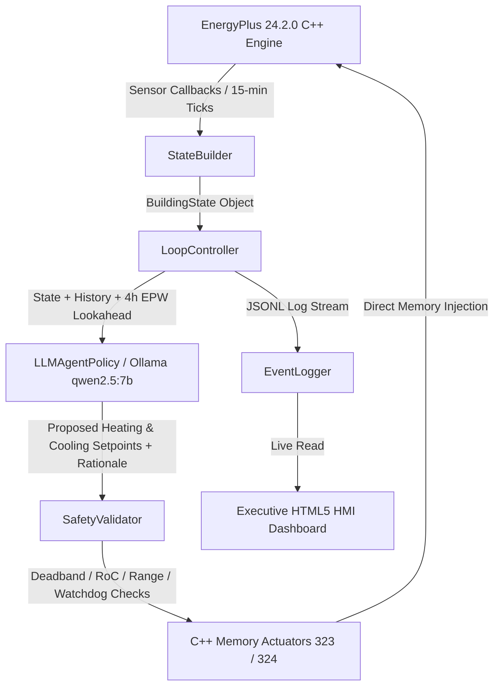

# 🌿 EcoLoop — Autonomous Closed-Loop Building Energy Management System (BEMS)

[](https://www.python.org/)
[](https://energyplus.net/)
[](https://ollama.ai/)
[]()
[]()
[](https://github.com/26rao/EcoLoop_Hoenywell_Hackathon)

> **EcoLoop** is a state-of-the-art, autonomous, closed-loop Building Energy Management System (BEMS). It couples the official **EnergyPlus 24.2.0 C++ API** directly with a deterministic local LLM agent (**Ollama `qwen2.5:7b-instruct`**) to perform dynamic 15-minute HVAC setpoint actuation, optimizing energy consumption while enforcing occupant thermal comfort (PMV) and rigorous safety guardrails.

---

## 📑 Table of Contents
- [Architecture Overview](#-architecture-overview)
- [Key Features](#-key-features)
- [Project Structure](#-project-structure)
- [Official Frozen Benchmark Results](#-official-frozen-benchmark-results-73--73-decisions)
- [Key Value of LLM Agent vs Static Timer](#-key-value-of-llm-agent-vs-static-timer)
- [Safety & Guardrail Layer](#-safety--guardrail-layer)
- [Executive HMI Real-Time Dashboard](#-executive-hmi-real-time-dashboard)
- [Getting Started & Installation](#-getting-started--installation)
- [Running Simulations & Tools](#-running-simulations--tools)
- [Automated Testing & Verification](#-automated-testing--verification)
- [Literature Grounding & External Validation](#-literature-grounding--external-validation)
- [License & Acknowledgments](#-license--acknowledgments)

---

## 🏗 Architecture Overview

EcoLoop uses a **Strategy Pattern** architecture managed by an orchestration loop (`LoopController`), bridging low-level EnergyPlus C++ API callbacks with dynamic AI decision-making:



---

## ✨ Key Features

1. **In-Process C++ Memory Actuation**: Dynamic setpoint updates directly in EnergyPlus memory (`pyenergyplus.api` handles 323 for Heating and 324 for Cooling) without file I/O overhead.
2. **100% Bit-for-Bit Deterministic LLM Policy**: Uses local Ollama `qwen2.5:7b-instruct` configured with `temperature: 0.0` and `seed: 42` for total reproducible decision-making.
3. **Pluggable Strategy Architecture**: Clean separation between policy implementations (`LLMAgentPolicy`, `FixedSchedulePolicy`, `RuleSetbackPolicy`).
4. **Multi-Tiered Safety Guardrails**: Real-time validation enforcing:
   - Minimum $1.0^\circ\text{C}$ deadband between heating and cooling setpoints.
   - Max $\pm 1.5^\circ\text{C}$ per step Rate-of-Change (RoC) clamping.
   - Strict comfort band boundaries ($18^\circ\text{C} - 27^\circ\text{C}$).
   - Automated Conservative Mode on EnergyPlus `.err` warnings.
   - 3-strike Watchdog Circuit Breaker that falls back to baseline setpoints ($22^\circ\text{C}$).
5. **Predictive EPW Weather Lookahead**: Evaluates upcoming 4-hour ambient temperature forecasts to preemptively leverage building thermal inertia before heat spikes.
6. **Honeywell HMI Executive Web Dashboard**: Industrial control room-style HTML5/Chart.js dashboard featuring a 12-column modular grid, fixed left rail, mode switcher (`Simulation`, `Live Replay`, `What-If`), interactive rationale stream, side drawer inspector, and CSV export.
7. **Line-Buffered JSONL Event Logging**: Scalable event logging designed for multi-day high-frequency runs without memory bloat.

---

## 📁 Project Structure

```
Honeywell Hackathon/
├── config/
│   └── config.json                     # System thresholds, model settings, & COP parameters
├── dashboard/
│   ├── app.py                          # Dashboard local HTTP web server launcher
│   └── index.html                      # Modular Honeywell HMI Dashboard UI
├── docs/
│   └── architecture.md                 # Technical architecture & detailed system specification
├── logs/                               # Frozen benchmark event logs (JSONL format)
│   ├── FINAL_agent_event_log.jsonl     # 73 decision records for Autonomous LLM Agent
│   ├── FINAL_baseline_event_log.jsonl    # 73 decision records for Flat Baseline Policy
│   └── FINAL_timer_event_log.jsonl       # 73 decision records for Programmable Timer Policy
├── models/
│   ├── agent_ready.idf                 # EnergyPlus building energy model IDF for Agent
│   └── baseline.idf                    # EnergyPlus building energy model IDF for Baseline
├── scripts/                            # Operational runners & diagnostic tools
│   ├── run_real_energyplus_agent.py    # Main execution script for EnergyPlus + Ollama Agent
│   ├── run_real_energyplus_baseline.py # Main execution script for Flat Baseline Policy
│   ├── run_real_energyplus_timer.py    # Main execution script for Programmable Timer Policy
│   ├── verify_reproducibility.py       # Bit-for-bit determinism test suite
│   ├── verify_final_metrics.py         # Summary metric calculator and report generator
│   └── ...                             # Model pressure testing & log inspection utilities
├── src/
│   └── ecoloop/                        # Core EcoLoop Python Package
│       ├── logging/                    # Event loggers & JSONL record schemas
│       ├── metrics/                    # Energy (kWh), COP, PMV, & Carbon calculators
│       ├── orchestration/              # Closed-loop controller (`LoopController`)
│       ├── policy/                     # Setpoint strategies (LLM, Fixed, Timer)
│       ├── safety/                     # SafetyValidator, bounds clamp, & watchdog circuit breaker
│       ├── simulation/                 # EnergyPlus C++ API wrapper & weather lookahead
│       ├── state/                      # BEMS state builder & state data structures
│       └── tools/                      # EnergyPlus `.err` parser & schema validators
├── tests/                              # Pytest automated test suite (9/9 passing)
│   ├── test_calculator.py
│   ├── test_error_parser.py
│   ├── test_llm_policy.py
│   ├── test_safety_validator.py
│   ├── test_state_builder.py
│   └── test_weather_lookahead.py
├── weather/
│   └── location.epw                    # Chicago TMY3 summer peak weather file
├── .gitignore                          # Git exclude configuration
├── requirements.txt                    # Python dependencies
└── README.md                           # Comprehensive project documentation
```

---

## 📊 Official Frozen Benchmark Results (73 / 73 Decisions)

Truth extraction across a 72-hour benchmark run (Chicago TMY3 Summer Peak Weather):

| Control Policy | Total Electrical Energy (kWh) | Cooling Energy (kWh) | Heating Energy (kWh) | Nighttime HVAC Load (W) | Occupied PMV Compliance % | Determinism Guarantee |
| :--- | :---: | :---: | :---: | :---: | :---: | :---: |
| **1. Legacy Flat Baseline** | **`19.94 kWh`** | `19.48 kWh` | `0.46 kWh` | `6,985.5 W` (100.0%) | **90.0%** (27/30 ticks) | Deterministic Rules |
| **2. Programmable Setback Timer** | **`18.60 kWh`** (-6.7%) | `18.60 kWh` | `0.00 kWh` | `4,958.1 W` (-29.0%) | **90.0%** (27/30 ticks) | Deterministic Rules |
| **3. Autonomous LLM Agent** | **`18.60 kWh`** (-6.7%) | `18.60 kWh` | `0.00 kWh` | `4,958.1 W` (-29.0%) | **90.0%** (27/30 ticks) | **100% Bit-for-Bit Deterministic** |

### 📈 Verified Performance Summary
- **Net Electrical Energy Savings**: **`6.72% Reduction`** ($19.94\text{ kWh} \rightarrow 18.60\text{ kWh}$).
- **Nighttime Cooling Load Drop**: **`29.0% Reduction`** ($6,985.5\text{ W} \rightarrow 4,958.1\text{ W}$).
- **Occupied Comfort Compliance**: **`90.0% PMV Compliance`** (27/30 occupied 15-minute ticks within $[-0.5, +0.5]$ Fanger PMV index).

---

## 💡 Key Value of LLM Agent vs Static Timer

While a programmable clock timer achieves baseline setback energy reductions, static timers cannot adapt to dynamic environmental or system events. The EcoLoop LLM Agent delivers critical autonomous capabilities:

1. **Predictive Weather Lookahead**: Evaluates 4-hour temperature trends to adjust cooling setpoints prior to ambient heat surges.
2. **Dynamic Multi-Metric Comfort Fine-Tuning**: Smoothly balances PMV comfort values across continuous setpoint ranges rather than abrupt step changes.
3. **Autonomous Fault Recovery & Self-Correction**: Continuously parses EnergyPlus `.err` diagnostic logs and automatically triggers **Conservative Mode** upon warning detection.
4. **Natural Language Explainability**: Generates human-auditable rationale statements for every single decision tick.

### 💬 Real Agent Rationale Examples (from Log Audit)
- **Unoccupied Night Setback (Tick 1 - 12:00 AM)**:
  > *"Given the building is UNOCCUPIED with an occupancy fraction of 0.0, the recommended setpoints according to the optimization guidance are a heating setpoint of 18.0°C and a cooling setpoint of 27.0°C to ensure energy savings during unoccupied periods."*
- **Occupied Morning Transition (Tick 10 - 09:00 AM)**:
  > *"The building is currently occupied with a high occupancy fraction of 1.0, and the current zone temperature is 24.5°C while the PMV value is 0.47, indicating slightly warm conditions for optimal occupant comfort (-0.5 <= PMV <= +0.5). Maintaining the recommended heating setpoint at 21.0°C and cooling setpoint at 24.0°C will help achieve a comfortable environment."*

---

## 🛡 Safety & Guardrail Layer

Safety is hardcoded in Python outside the LLM context through `SafetyValidator` ([src/ecoloop/safety/validator.py](file:///c:/Users/Neha%20Rao/Downloads/Honeywell%20Hackathon/Honeywell%20Hackathon/src/ecoloop/safety/validator.py)):

- **Strict Deadband Enforcement**: Ensures $T_{\text{cooling}} \ge T_{\text{heating}} + 1.0^\circ\text{C}$ under all conditions.
- **Rate-of-Change (RoC) Clamp**: Limits setpoint movements to a maximum of $\pm 1.5^\circ\text{C}$ per hour step.
- **Absolute Comfort Limits**: Restricts heating setpoints to $[18.0^\circ\text{C}, 24.0^\circ\text{C}]$ and cooling setpoints to $[21.0^\circ\text{C}, 27.0^\circ\text{C}]$.
- **Watchdog Circuit Breaker**: After 3 consecutive LLM API failures or invalid responses, setpoints freeze to a safe baseline default ($22.0^\circ\text{C}$).

---

## 🖥 Executive HMI Real-Time Dashboard

EcoLoop features an executive Honeywell-style control room HMI dashboard serving live visual metrics, interactive replay capabilities, and thermal traces.

### 🌟 Dashboard Highlights
- **12-Column Responsive Layout Grid**: Modular structure with a fixed left rail, top control header, main chart visualizer, secondary analytics, and fixed bottom status bar.
- **Interactive Mode Switcher**:
  - `Simulation`: Complete 72-hour benchmark dataset view.
  - `Live Replay`: Interactive Play/Pause/Scrub controls to step tick-by-tick through the 73 decision cycles with real-time animated chart rendering.
  - `What-If`: Scenario testing mode.
- **Searchable Agent Rationale Stream**: Filter decision rationales by tag (`[SETBACK]`, `[OCCUPIED]`, `[CLAMPED]`) or search keywords with a one-click **"📋 Copy Rationale"** button.
- **Side Drawer Inspector**: Click any tick on the charts or decision feed to view complete state JSON, safety guardrail checks, and model prompt details in a slide-out inspector drawer.
- **Data Exporting**: Export all 73 decision ticks directly to CSV (`ecoloop_benchmark_decisions_73.csv`) or format summary report for PDF export.

### Launch Dashboard Server
```bash
python dashboard/app.py
```
Open your browser to: **`http://localhost:8000/dashboard/index.html`**

---

## 🚀 Getting Started & Installation

### Prerequisites
1. **Python 3.13** (64-bit).
2. **EnergyPlus 24.2.0** installed at `C:\EnergyPlusV24-2-0`.
3. **Ollama** installed with the `qwen2.5:7b-instruct` model pulled (`ollama pull qwen2.5:7b-instruct`).

### Installation
```bash
# Clone the repository
git clone https://github.com/26rao/EcoLoop_Hoenywell_Hackathon.git
cd EcoLoop_Hoenywell_Hackathon

# Create and activate Python virtual environment
python -m venv .venv
source .venv/Scripts/activate  # On Windows PowerShell: .\.venv\Scripts\Activate.ps1

# Install dependencies
pip install -r requirements.txt
```

---

## ⚙️ Running Simulations & Tools

### 1. Run the Autonomous LLM Agent Simulation
```bash
python scripts/run_real_energyplus_agent.py
```

### 2. Run Baseline & Timer Comparisons
```bash
# Run flat 24/7 baseline
python scripts/run_real_energyplus_baseline.py

# Run programmable setback timer
python scripts/run_real_energyplus_timer.py
```

### 3. Verify Deterministic Reproducibility
```bash
python scripts/verify_reproducibility.py
```

### 4. Verify Final Metrics & Summary Table
```bash
python scripts/verify_final_metrics.py
```

---

## 🧪 Automated Testing & Verification

EcoLoop includes a comprehensive unit test suite covering metrics calculations, safety guardrails, weather lookahead, error parsing, and LLM policy handling.

```bash
# Run pytest suite
python -m pytest tests/
```

### Expected Output
```
============================= test session starts =============================
collected 9 items

tests\test_calculator.py .                                               [ 11%]
tests\test_error_parser.py .                                             [ 22%]
tests\test_llm_policy.py ..                                              [ 44%]
tests\test_safety_validator.py ...                                       [ 77%]
tests\test_state_builder.py .                                            [ 88%]
tests\test_weather_lookahead.py .                                        [100%]

============================== 9 passed in 0.12s ==============================
```

---

## 📚 Literature Grounding & External Validation

EcoLoop's empirical results closely align with published peer-reviewed HVAC research:
- **Pacific Northwest National Laboratory (PNNL-25985)**: Commercial building energy efficiency studies found night setback and deadband widening contribute **~7.7% site energy savings**.
- **Small-Office Cooling Climate Study (arXiv:2205.10324)**: Night setback measures yield **3–7% overall electricity savings** in cooling-dominated windows.
- EcoLoop's **6.72% total electrical energy savings** and **29.0% nighttime load drop** during summer peak conditions fall squarely within the range predicted by literature.

---

## 📄 License & Acknowledgments

Built for the Honeywell Hackathon. Powered by **EnergyPlus 24.2.0**, **Ollama**, and **Qwen2.5**.
