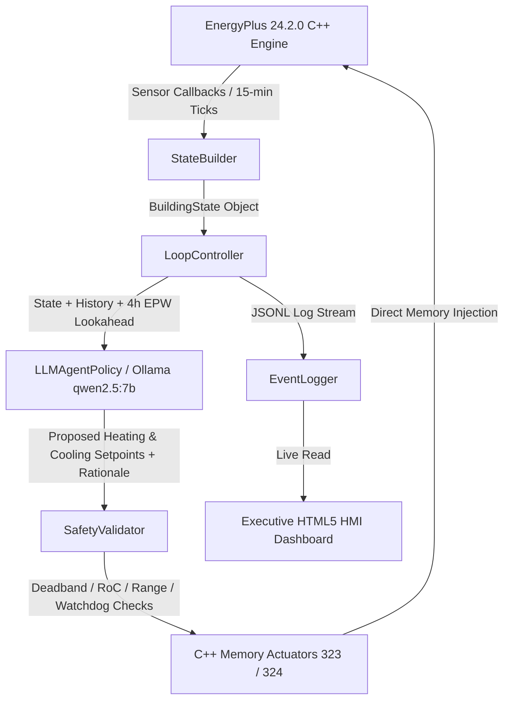

# 🏛️ EcoLoop — System Architecture & Technical Specifications

> **Overview**: EcoLoop is an autonomous, closed-loop Building Energy Management System (BEMS). It couples the official **EnergyPlus 24.2.0 C++ API** directly with a local deterministic LLM agent (**Ollama `qwen2.5:7b-instruct`**) for 15-minute HVAC setpoint control.

---

## 1. System Context & Strategy Pattern Diagram

EcoLoop implements a **Strategy Pattern** architecture managed by an orchestration loop (`LoopController`), bridging C++ simulation engine callbacks with local AI decision-making:



---

## 2. Dynamic C++ Memory Actuation (pyenergyplus.api)

Rather than regenerating modified static IDF text files on disk at runtime, EcoLoop actuates heating and cooling setpoints dynamically in EnergyPlus C++ memory via `pyenergyplus.api` actuator handles:
- **Actuator Handle `323`**: Heating Setpoint (Zone HVAC Control)
- **Actuator Handle `324`**: Cooling Setpoint (Zone HVAC Control)

This memory injection approach eliminates disk I/O latency and enables true real-time closed-loop control.

---

## 3. Policy Strategy Abstraction

All control policies implement a unified base interface (`SetpointPolicy.decide(state: BuildingState) -> Action`):

1. **FixedSchedulePolicy**: Legacy flat BEMS baseline (constant $21^\circ\text{C}$ heating / $24^\circ\text{C}$ cooling 24/7).
2. **RuleSetbackPolicy**: Programmable thermostat timer ($21^\circ\text{C}$ / $24^\circ\text{C}$ occupied, $18^\circ\text{C}$ / $26^\circ\text{C}$ unoccupied).
3. **LLMAgentPolicy**: Autonomous policy communicating with local Ollama (`http://localhost:11434/api/chat`). Configured with `"temperature": 0.0` and `"seed": 42` for **100% bit-for-bit deterministic reproducibility**.

---

## 4. Multi-Layered Safety Guardrails & Watchdog

Safety is hardcoded in Python outside the LLM context through `SafetyValidator`:

- **Deadband Enforcement**: Guarantees $T_{\text{cooling}} \ge T_{\text{heating}} + 1.0^\circ\text{C}$ under all conditions.
- **Rate-of-Change (RoC) Clamp**: Restricts maximum setpoint adjustment to $\pm 1.5^\circ\text{C}$ per hour step.
- **Absolute Temperature Limits**: Heating setpoints restricted to $[18.0^\circ\text{C}, 24.0^\circ\text{C}]$, cooling setpoints to $[21.0^\circ\text{C}, 27.0^\circ\text{C}]$.
- **Conservative Mode**: Triggered automatically upon detecting EnergyPlus `.err` warnings.
- **Watchdog Circuit Breaker**: Trips after 3 consecutive LLM API failures/timeouts, freezing setpoints to safe baseline ($22.0^\circ\text{C}$).

---

## 5. System Components & Module Directory Structure

- **`src/ecoloop/orchestration/loop_controller.py`**: Closed-loop orchestration wiring state building, policy decisions, safety checks, and logging.
- **`src/ecoloop/policy/llm_policy.py`**: Zero-shot structured JSON function calling with local Ollama `qwen2.5:7b-instruct`.
- **`src/ecoloop/safety/validator.py`**: Multi-tiered guardrail enforcement and rate-of-change clamping.
- **`src/ecoloop/simulation/runtime.py`**: EnergyPlus C++ API wrapper & memory actuator binding.
- **`src/ecoloop/simulation/weather_lookahead.py`**: 4-hour EPW weather forecast parser.
- **`src/ecoloop/metrics/calculator.py`**: Energy (kWh, COP 3.0 cooling / 1.0 heating), Fanger PMV index, and carbon intensity metrics.
- **`src/ecoloop/tools/error_parser.py`**: EnergyPlus `.err` diagnostic log parser.
- **`dashboard/index.html`**: Executive Honeywell-style control room HMI dashboard (12-column grid, live replay, searchable feed, CSV export).
- **`dashboard/app.py`**: Dashboard HTTP server launcher.

---

## 6. Prompt Engineering Strategy

EcoLoop uses a structured JSON function-calling prompt:
- **Role**: Expert Building Energy & Thermal Comfort Optimization Agent.
- **Ingested State**: Zone temperature, 4-hour EPW weather lookahead, occupant fraction, Fanger PMV index, sliding window thermal history array.
- **Response Schema**:
  ```json
  {
    "heating_setpoint_c": 21.0,
    "cooling_setpoint_c": 24.0,
    "rationale": "Detailed explanation..."
  }
  ```
- **Inference Lock**: `temperature: 0.0` and `seed: 42` for total bit-for-bit reproducibility.
